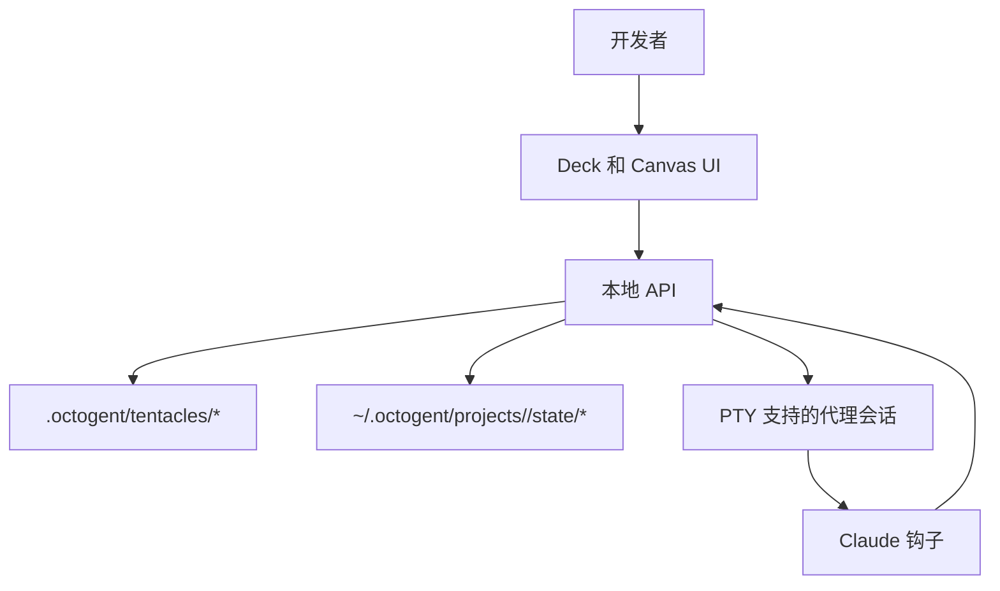

# 心智模型

本页面阐述 Octogent 背后的精确模型。README 是宣传介绍，本页面是边界地图。

## 架构层次

Octogent 将持久的工作上下文与实时的终端执行分离。

- **开发者**定义边界、审查输出并决定最终内容
- **触手（tentacle）**是持久的工作上下文：markdown 文件、待办事项、备注和交接状态
- **终端（terminal）**是运行时记录，以及（当处于活动状态时）一个 PTY 支持的代理会话
- **工作代理（worker）**是分配执行某一较窄任务的终端，通常对应一个待办事项
- **父代理（parent）**是协调工作代理并执行最终审查或合并工作的终端
- **通道（channel）**是用于向实时终端注入短消息的内存队列

## 触手 vs 终端

这是两个不同的概念。

- **触手**是一个包含代理可读文件的文件夹
- **终端**是一个可以挂载到一个触手的运行时对象

多个终端可以指向同一个触手。集群工作代理利用了这一特性：每个工作代理获得相同的上下文文件，但每个终端拥有自己的身份、转录、生命周期状态和可选的工作树。

这就是终端 ID 和触手 ID 不可互换的原因。一个终端可以被命名为 `api-runtime-swarm-2`，同时仍使用 `api-runtime` 触手上下文。

## 触手 vs 工作树

这也是两个不同的概念。

- **触手**是上下文层
- **工作树**是 git 隔离层

一个触手可以通过以下方式使用：

- 共享工作空间终端
- 工作树支持的终端

触手决定工作的内容，工作树决定代码修改发生的位置。

在共享模式下，PTY 在主工作空间中启动。在工作树模式下，API 创建 `.octogent/worktrees/<worktree-id>/` 目录，分支为 `octogent/<worktree-id>`，并在此启动 PTY。面向代理的上下文仍保留在 `.octogent/tentacles/<tentacle-id>/` 中。

## 哪些内容属于文件

持久化的真实来源应保存在触手内的文件中。

这包括：

- 有关该领域的上下文
- 备注和交接信息
- `todo.md` 中的当前任务列表

如果另一个代理稍后需要理解这项工作，重要信息应已存在于文件中，而不依赖于某一条旧的聊天记录。

Deck 直接读取这些文件。它解析 `CONTEXT.md` 中的第一个标题和第一个非空段落用于显示元数据，将其他 markdown 文件列为保险库文件，并解析 `todo.md` 中的复选框行用于进度和工作分配。

## 哪些内容属于运行时状态

运行时拥有：

- 终端记录和生命周期状态
- 实时 PTY 会话
- WebSocket 传输
- UI 状态
- 转录
- 消息投递状态

这些数据帮助应用运行，但它们不等同于持久的工作上下文。终端记录在 API 重启后仍存在。PTY 会话、WebSocket 客户端和通道队列则不会。

启动时，Octogent 从 `tentacles.json` 重新加载终端记录。如果记录显示它正在运行，Octogent 无法重新连接到旧的内存中 PTY，因此该记录会被协调为 `stale`（已过时）状态，并附带生命周期原因。

## 委派应该如何工作

预期的流程是：

1. 开发者或父代理定义工作边界
2. 触手文件捕获本地上下文
3. `todo.md` 将工作分解为可执行的复选框项
4. Deck 或 CLI 根据这些项创建终端
5. 每个工作代理收到一个提示，该提示基于触手上下文路径、待办文本、工作空间模式以及（如果存在）父终端 ID 生成
6. 工作代理通过短通道消息以及在文件中留下持久备注来报告状态
7. 父代理或人工审查结果并更新 `todo.md`

如果边界模糊，编排效果就会变差。Octogent 有助于组织工作，但无法挽救一个定义不清的任务。

## 该项目实际希望验证什么

- 终端编码代理可以被视为编排层中的构建块
- 基于文件的上下文比试图将一切保持在一段长对话中更可靠
- 一个 Claude Code 会话可以以可见的方式协调其他 Claude Code 会话
- 简单的任务列表和短消息足以支持某些有用的多代理工作流

> 本文件是 [../../concepts/mental-model.md](../../concepts/mental-model.md) 的中文翻译版本。如有歧义，以英文原文为准。
